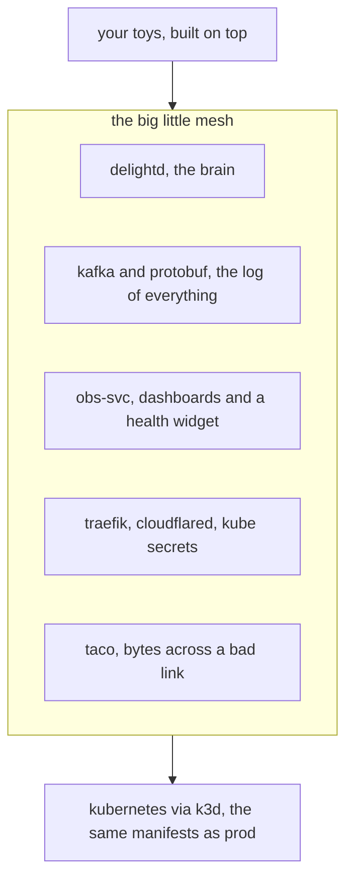

# big little mesh

big-company developer infrastructure — orchestration, central logging, a secrets
service, dev and prod, observability — shrunk to fit one laptop. a small set of
agent-first services that make working solo feel like working somewhere with a
few thousand engineers. here's the roster; the *why* is below it.

| what | it does | repo |
|---|---|---|
| **delightd** | the brain: what's deployed, what's running, what's safe | [janearc/delightd](https://github.com/janearc/delightd) |
| **kafka-svc** | the event bus and the log of everything | [janearc/kafka-svc](https://github.com/janearc/kafka-svc) |
| **obs-svc** | dashboards and a floating health widget | [janearc/obs-svc](https://github.com/janearc/obs-svc) |
| **taco** | resilient transfers across a bad link | [janearc/taco](https://github.com/janearc/taco) |
| **paling** | a fine-tuner that learns your voice | [janearc/paling](https://github.com/janearc/paling) |
| **magpie** | voice memos in, clean transcripts out | [janearc/magpie](https://github.com/janearc/magpie) |
| **good-citizen** | the shared library the services are built on — contracts, kafka, watching, scheduling | _this repo_ |
| traefik, cloudflared, kube secrets | the edge: routing, exposure, the vault | _the perimeter_ |

i am primarily (hi, i'm [max](https://github.com/janearc)) or perhaps only a backend engineer. and i have really only professionally worked in large environments where there was platform and infra or i was part of the effort to build that. i am a big believer in containerisation and to a lesser extent virtualisation, so when docker started to swallow devops (where i lived at the time), [it was a welcome change for me](https://youtu.be/FDgQdjidXpY).

a consequence of the way i write software and the environments in which i work professionally is almost no software i ever write has any kind of human interface. this is cool for a backend engineer, because that's kind of what we do: go away, you can just curl the endpoint and jq it, i can't explain it, it's in the backend, it's produced from a bunch of services that might even be degraded or down.

**this presents a problem for solo developers.** so the way that i've been writing software for a long time essentially requires me to have an environment that essentially never exists on a team of one.

- central logging
- orchestration
- manual and automated deployment
- secrets service
- separate dev and prod environments
- storage of assorted things including rag

these are just nice features of working in a big company with a few thousand engineers. but they're probably not on your laptop.

## YNAM: you need a mesh
## (probably a big, but *little*, mesh)

that's kind of a lot of work and it's a pain to manage, and it takes up resources, which is why nobody does this on your laptop. but what if you got laid off by a guy who wants to buy a few more superyachts? what if you quit your job to go on a sabbatical and you came back to find the industry in flames? what if you're retired? what if you just have really good taste in building software? shouldn't you have all this nice stuff for yourself?

well, yeah, i think so too. so i built this big little mesh for myself, because it lets me work the way that i *work*, even when i'm fucking around and building toys for myself like a neat little in-browser bicycle geometry studio, or a locally-hosted image and video generation pipeline. these are cool things that you can have, and blm, the big little mesh, aims to provide. the goal is simple: have enough infrastructure on your development machine (a laptop, for example, we're not talking deskside workstations with IR2 graphics pipelines, something that you can fit in your backpack and commute with) so that when you sit down to write code, it feels *almost exactly like it does at work on a nice day.*

one note about style before we get into the details: if you worked at uber in the 2014-2017 era, blm will feel pretty familiar. uber used peloton and aurora and mesos, we have kubernetes, which is what uber eventually moved to. delightd is basically a combination of udeploy and self-hosting (anything you run locally is deployed locally in kube, but you could just as easily deploy that image to a production cluster the same way) and what we called "developer experience," making sure that you have all the tools you need to do your job without hassles. there is kafka, but that's a good thing because it helps you debug things. and you make bugs for a living. it's okay. but you do. there's no schemaless but that's something i'm thinking about. and everything speaks protobuf which will (unfortunately) remind you of thrift… but the good news is this has all the benefits it does in the enterprise: everything is deployed with a contract, every inter-service message is validated, there's a log of *everything*, and it's easy to find and query.

there's no puppet, and there's no clusto. let's continue.

## so what is in this big little mesh?

less than you'd think, which is the entire point. it's a *little* mesh. you don't need a thousand engineers' worth of platform. you need the handful of pieces that actually make the day feel good, and you need them to talk to each other. here's the handful.

the substrate is **kubernetes**, locally, and k3d. the thing you run on your laptop today is the same manifest you'd ship to a production cluster tomorrow (that's the whole point; you're on your own right now or today, but you still write code like you're one of thousands). the only difference is which cluster you point at. that's the part that makes it feel like work instead of playing house: you're running the real thing. it's big, but little enough.

the brain is **delightd**. it's the source of truth for what's deployed, what's running, and importantly (because backend engineers are not good at trust), whether your work is *safe*. it watches every project's git state and quietly checkpoints anything you haven't saved. it's part udeploy, part self-hosting, part the thing big companies politely call "developer experience": it generates the tooling you use so you never have to keep any of this in your head.

and **kafka** (just take a deep breath, it will be fine), and everything on it speaks **protobuf** through a schema registry. that reads like enterprise box-ticking right up until you remember what it buys you: every message between services is validated against a contract, and there is a log of *everything*, queryable after the fact. you make bugs for a living. this is how you find one at 1am without adding a single print statement. the hot path is also heavily instrumented with metrics so when you're doing model training or ML jobs, you already have the information you need to figure out what's up, what's good, and what's not.

then the boring, load-bearing bits, the ones you only notice once they're gone. **traefik** (you can use Envoy if you like but uber engineers have always been sceptical of Envoy. it seems nice.) is the single front door that routes to whatever's up. **kube secrets** is a real secret store, so your credentials live somewhere that isn't a `.env` you'll commit by accident, and your agents are never going to see it so there's no risk of exposed secrets through context. secrets are treated like radioactive spills. **obs-svc** is your dashboards and a small floating health widget (in rust just to keep you entertained), so you can watch the mesh breathe without `kubectl get pods` reflexes. and **cloudflared** is there for when you need to show someone a thing and you're on the ferry from sf to jack london square.

and one piece that exists only because the rest of the world doesn't run on fiber: **taco**, for moving bytes across a bad link — a plane, a train, hotel wifi, a metered hotspot — and actually finishing.

that's the mesh. it is deliberately small, and it is meant to disappear. because the point was never the infrastructure — the point is what you build once it's handled: a fine-tuner that trains on your own voice, a local image-and-video pipeline, the bike geometry studio, whatever you sat down to make. the mesh is the part you get to stop thinking about.

## the part early uber didn't have

here's where blm stops being a 2016 uber tribute act. early uber gave you stateless services, everything-is-a-deployment, contracts on the wire, a log of everything — a particular way of seeing the world where nothing is precious and everything is reproducible. (if "everything is a kube deployment" is a hermeneutic, blm is the same one.) blm is built on exactly that worldview. but it adds the thing 2016 had no use for: it's agent-first.

what that means in practice: every capability in the mesh emits json by default, ships a little cli wrapper, and registers itself as a skill. delightd aggregates those skills and serves them over mcp. so an llm agent can operate the whole mesh the same way you can — deploy a service, ask what's dirty, read the logs, kick off a training job — because everything is already legible to it: contracts, json, discoverable, no hidden state.

and that legibility isn't a feature you bolt on, it's the dividend. the discipline that made the uber world pleasant for humans and services — stateless, contract-first, reproducible, observable — is exactly what makes a mesh legible to an agent. you didn't strap an llm onto a pile of shell scripts; you built the disciplined substrate, and the agent comes along for free, because it wants precisely what a well-behaved service wants. the human and the agent pair on the same mesh, reading the same json, trusting the same contracts. (and, per the radioactive-spills rule above, the agent never sees your secrets — legibility stops at the vault door.)
